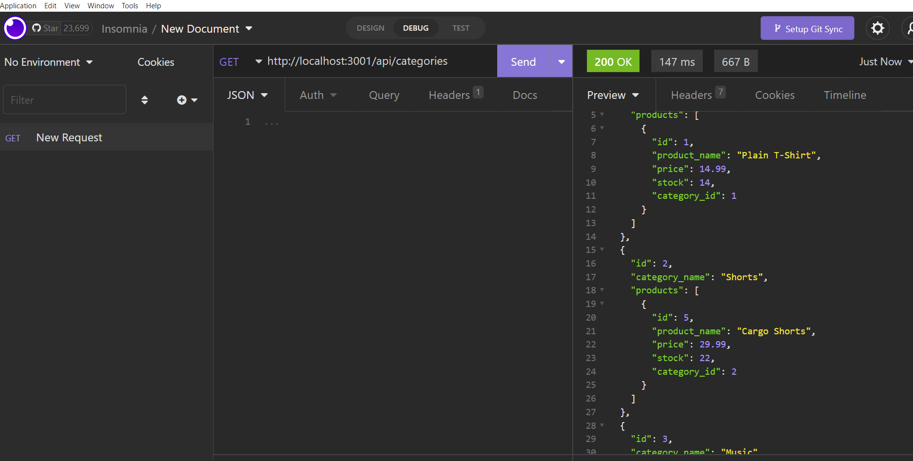
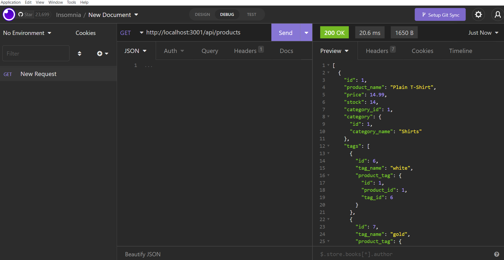
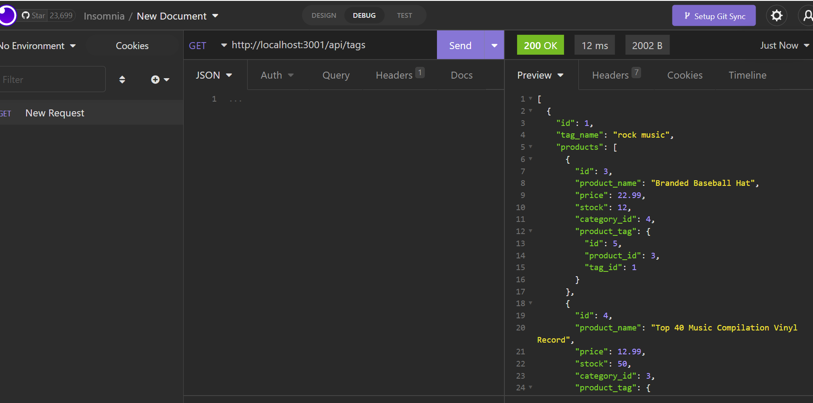

# E-Commerce Back-end

- Built the back end for an e-commerce site using Express.js API and configured it to use Sequelize to interact with a MySQL database.

## Author

- ## [@brittanyremus](https://www.github.com/bremus124)

## Screenshot

--

## Deployment

- To deploy this project run:
  - Repository: https://github.com/bremus124/e-commerce-back-end
  - Video: https://drive.google.com/file/d/1d6w3wmhVhRuGtQzwZDjBwQjmJQ-dV0Qf/view
